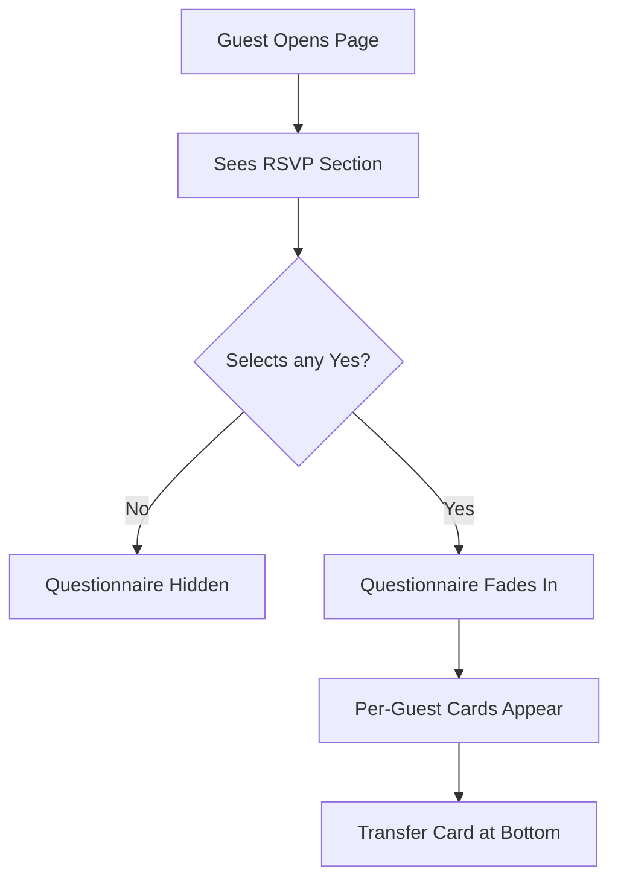

# Story 2.4: Guest Questionnaire

Status: review

## Story

As a Guest,
I want to answer additional questions about my preferences (menu, allergies, alcohol, transfer),
So that the hosts can plan the event and catering according to my needs.

## Context

The current RSVP flow allows guests to confirm attendance (Yes/No) for each household member. This story extends the flow by adding a questionnaire section that collects additional information needed for event planning:

- **Menu preferences** (choice of main course)
- **Food allergies / dietary restrictions** (critical for safety)
- **Alcohol preferences** (multi-select, budget and inventory planning)
- **Transfer needs** (logistics and transportation)

> [!IMPORTANT]
> **Data Applies Per-Guest vs Per-Household:**
> - **Menu**: Per-guest (each person may prefer different dish)
> - **Allergies**: Per-guest (safety critical — each person's restrictions matter)
> - **Alcohol**: Per-guest (individual preferences)
> - **Transfer**: Per-household (family travels together)
>
> When opened by a Head of Household (HoH), the UI allows selecting options for *each* attending member in a streamlined form.

## Acceptance Criteria

1. **Given** The user confirms "Yes" for at least one household member
   **When** They complete RSVP selection (any "Yes" response)
   **Then** A "Questionnaire" section smoothly appears below (progressive disclosure)
   **And** All questions are optional (can be skipped)

2. **Given** The page is opened by a Head of Household with multiple attending members
   **When** They view the questionnaire
   **Then** They see a card for each attending guest with individual options
   **And** Guest names are displayed above each card
   **And** Selections are saved per-guest

3. **Given** The questionnaire is displayed
   **When** The user selects a menu option for a guest
   **Then** Options include: "🥩 Мясо" (Meat), "🐟 Рыба" (Fish), "🥗 Вегетарианское" (Vegetarian)
   **And** If guest is a child (age < 12), show additional "🍝 Детское меню" (Kids Menu) option
   **And** Selection auto-saves with visual confirmation

4. **Given** The questionnaire is displayed
   **When** The user enters allergy information for a guest
   **Then** They see a friendly prompt: "Есть ли пищевые ограничения?" (Any dietary restrictions?)
   **And** They can select common allergens via checkboxes: Орехи (nuts), Морепродукты (seafood), Глютен (gluten), Лактоза (lactose)
   **And** They can enter custom text in "Другое" (Other) field
   **And** "Нет ограничений" (No restrictions) option is available to explicitly indicate no allergies
   **And** Data auto-saves per guest

5. **Given** The questionnaire is displayed
   **When** The user selects alcohol preferences for a guest
   **Then** Options include: "🍷 Вино", "🥂 Шампанское", "🥃 Крепкие напитки", "🚫 Безалкогольное"
   **And** MULTI-SELECT is allowed (can choose wine AND champagne AND spirits)
   **And** Selecting "🚫 Безалкогольное" deselects other options (mutually exclusive)
   **And** Data auto-saves per guest

6. **Given** The questionnaire is displayed
   **When** The user answers transfer question
   **Then** Options include: "🚌 Да, нужен трансфер" / "🚗 Нет, приеду сам"
   **And** This is shown ONCE per household (not per guest) 
   **And** A helper text explains: "Трансфер организуется для всей семьи"

7. **Given** Any questionnaire data is saved
   **When** The host views the Admin Dashboard
   **Then** They can see all questionnaire responses per guest
   **And** Allergies are highlighted in a warning color for visibility

## Tasks / Subtasks

- [x] Extend Guest Model (`src/models/Guest.ts`) (AC: 3, 4, 5)
  - [x] Add `menuChoice: 'meat' | 'fish' | 'vegetarian' | 'kids' | null`
  - [x] Add `allergies: string[]` (array of allergen keys: 'nuts', 'seafood', 'gluten', 'lactose')
  - [x] Add `allergiesOther: string` (custom text)
  - [x] Add `hasNoAllergies: boolean` (explicit "no allergies" confirmation)
  - [x] Add `alcoholPreferences: string[]` (multi-select: 'wine', 'champagne', 'spirits', 'none')
  - [x] Keep existing `dietaryRestrictions` for backward compatibility

- [x] Extend Household Model (`src/models/Household.ts`) (AC: 6)
  - [x] Add `needsTransfer: boolean | null` (null = not answered yet)
  - [x] Add `transferPickupLocation: string` (optional, for custom pickup notes)

- [x] Create GuestQuestionnaireSection Component (`src/components/questionnaire/GuestQuestionnaireSection.tsx`) (AC: 1)
  - [x] Only display if at least one guest has `isAttending: true`
  - [x] Section header: "🍽️ Несколько вопросов" with romantic styling
  - [x] Animate appearance with fade-in after RSVP confirmation
  - [x] Subtitle: "Чтобы сделать праздник идеальным для вас" (To make the celebration perfect for you)

- [x] Create GuestPreferenceCard Component (`src/components/questionnaire/GuestPreferenceCard.tsx`) (AC: 2, 3, 4, 5)
  - [x] Display guest name at the top of the card
  - [x] Contains MenuChoice, AllergyInput, and AlcoholPreference sections
  - [x] Each section is visually separated with dividers
  - [x] Unified card design per guest (not separate cards per question)

- [x] Create MenuChoiceButtons Component (`src/components/questionnaire/MenuChoiceButtons.tsx`) (AC: 3)
  - [x] Three or four emoji buttons depending on guest age:
    - 🥩 Мясо (Meat)
    - 🐟 Рыба (Fish)
    - 🥗 Вегетарианское (Vegetarian)
    - 🍝 Детское (Kids) — shown only if `guest.age < 12`
  - [x] Toggle behavior with single selection
  - [x] Auto-save on selection with subtle checkmark animation

- [x] Create AllergyInput Component (`src/components/questionnaire/AllergyInput.tsx`) (AC: 4)
  - [x] Friendly header: "Пищевые ограничения"
  - [x] Quick-select checkboxes for common allergens:
    - [x] 🥜 Орехи (nuts)
    - [x] 🦐 Морепродукты (seafood)
    - [x] 🌾 Глютен (gluten)
    - [x] 🥛 Лактоза (lactose)
  - [x] "Нет ограничений ✓" button that clears all checkboxes
  - [x] "Другое" text input for custom allergies (debounced auto-save)

- [x] Create AlcoholPreferenceButtons Component (`src/components/questionnaire/AlcoholPreferenceButtons.tsx`) (AC: 5)
  - [x] Four emoji toggle buttons (multi-select):
    - 🍷 Вино (Wine)
    - 🥂 Шампанское (Champagne)
    - 🥃 Крепкие (Spirits)
    - 🚫 Безалкогольное (Non-alcoholic)
  - [x] "Безалкогольное" is mutually exclusive — selecting it deselects others
  - [x] Selecting any alcohol option deselects "Безалкогольное"
  - [x] Auto-save on each toggle

- [x] Create TransferCard Component (`src/components/questionnaire/TransferCard.tsx`) (AC: 6)
  - [x] Displayed ONCE per household (not per guest)
  - [x] Header: "🚌 Трансфер"
  - [x] Helper text: "Нужен ли вашей семье трансфер до ресторана?"
  - [x] Two buttons: "Да, нужен" / "Нет, приедем сами"
  - [x] Note below: "Мы организуем трансфер от [location] в [time]" (configurable)

- [x] Create Server Actions (`src/actions/questionnaire.actions.ts`)
  - [x] `updateGuestMenu(guestId, menuChoice)` — updates single guest
  - [x] `updateGuestAllergies(guestId, allergies[], allergiesOther, hasNoAllergies)` — updates single guest
  - [x] `updateGuestAlcohol(guestId, alcoholPreferences[])` — updates single guest (with toggle logic for 'none')
  - [x] `updateHouseholdTransfer(householdId, needsTransfer)` — household-level

- [x] Integrate into Landing Page (`src/app/(public)/page.tsx`) (AC: 1)
  - [x] Add GuestQuestionnaireSection after RSVPSection
  - [x] Conditionally render based on attendance status
  - [ ] Smooth scroll behavior after RSVP completion (deferred - requires RSVP integration)

- [ ] Update Admin Dashboard (`src/app/(admin)/page.tsx`) (AC: 7)
  - [ ] Add columns/details for menu, allergies, alcohol, transfer
  - [ ] Highlight allergy cells in amber/warning color
  - [ ] Add export functionality for catering planning (CSV/JSON)
  - **BLOCKED**: Admin dashboard page does not exist yet - requires separate story to create admin interface

## UX Specifications

### Visual Design

| Token | Value | Usage |
|-------|-------|-------|
| `cream` | `#FFF8F0` | Section background |
| `gold` | `#D4AF76` | Section headers, accents |
| `blush` | `#F8B4C0` | Selected options |
| `sage` | `#B8C9A8` | Success states, "No allergies" |
| `amber` | `#F59E0B` | Allergy warnings in admin |
| `charcoal` | `#3D3D3D` | Primary text |

### Typography

- **Section Header**: Cormorant Garamond, 1.5rem (24px)
- **Guest Names**: Inter, 1.125rem (18px), semi-bold
- **Option Labels**: Inter, 1rem (16px)
- **Helper Text**: Inter, 0.875rem (14px), muted

### Per-Guest Card Layout

Since menus, allergies, and alcohol are per-guest, each attending guest gets their own card:

```
┌─────────────────────────────────────────────────────────┐
│                                                         │
│           🍽️ Несколько вопросов                         │
│      Чтобы сделать праздник идеальным для вас          │
│                                                         │
│  ┌───────────────────────────────────────────────────┐  │
│  │  👤 Сергей                                         │  │
│  │  ─────────────────────────────────────────────   │  │
│  │  Меню:                                            │  │
│  │  [🥩 Мясо]   [🐟 Рыба]   [🥗 Вегетарианское]       │  │
│  │                                                   │  │
│  │  Напитки:                                         │  │
│  │  [🍷]  [🥂]  [🥃]  [🚫 Без алкоголя]               │  │
│  │                                                   │  │
│  │  Пищевые ограничения:                             │  │
│  │  [ ] 🥜  [ ] 🦐  [ ] 🌾  [ ] 🥛   [✓ Нет]          │  │
│  │  Другое: [_______________]                        │  │
│  └───────────────────────────────────────────────────┘  │
│                                                         │
│  ┌───────────────────────────────────────────────────┐  │
│  │  👤 Елена                                          │  │
│  │  ─────────────────────────────────────────────   │  │
│  │  (same structure as above)                        │  │
│  └───────────────────────────────────────────────────┘  │
│                                                         │
│  ┌───────────────────────────────────────────────────┐  │
│  │  👤 Маша (ребёнок)                                 │  │
│  │  ─────────────────────────────────────────────   │  │
│  │  Меню:                                            │  │
│  │  [🥩]  [🐟]  [🥗]  [🍝 Детское меню]               │  │
│  │  ...                                              │  │
│  └───────────────────────────────────────────────────┘  │
│                                                         │
│  ┌───────────────────────────────────────────────────┐  │
│  │  🚌 Трансфер                                       │  │
│  │  Нужен ли вашей семье трансфер до ресторана?       │  │
│  │  [Да, нужен]     [Нет, приедем сами]              │  │
│  │                                                   │  │
│  │  ℹ️ Трансфер от центра города в 14:00              │  │
│  └───────────────────────────────────────────────────┘  │
│                                                         │
└─────────────────────────────────────────────────────────┘
```

### Interaction States

| State | Description | Visual |
|-------|-------------|--------|
| **Initial** | No selections | All buttons muted/outlined |
| **Selected** | User made choice | Button filled with `blush` |
| **Multi-selected** | Multiple alcohol options | Multiple filled buttons |
| **Saving** | Auto-save in progress | Subtle spinner on button |
| **Saved** | Data persisted | Brief ✓ checkmark flash (300ms) |
| **Exclusive** | "No alcohol" mode | Other options visually disabled |
| **Error** | Save failed | Shake animation, toast message |

### Progressive Disclosure Flow



### Micro-Animations

- **Section Appear**: Fade-in + slide-up (400ms ease-out)
- **Button Select**: Scale pulse (1.0 → 1.05 → 1.0) + color fill
- **Save Confirm**: Checkmark icon fades in (150ms), stays (200ms), fades out (150ms)
- **Error Shake**: Horizontal shake (-5px, 5px) × 3 cycles

### Accessibility

- Touch targets: minimum 48x48px
- Color contrast: WCAG AA (4.5:1)
- ARIA labels for screen readers (e.g., `aria-pressed` for toggle buttons)
- Keyboard navigation support (Tab, Enter/Space to toggle)
- Focus states visible with gold outline

## Dev Notes

### Architecture Compliance

- **Client Components**: All questionnaire components need `"use client"`
- **Server Actions**: Return `ActionResponse<T>` pattern
- **Auto-save**: Use `useTransition` + debounce (500ms) for text inputs
- **No Submit Button**: Per UX anti-patterns, use auto-save for all fields
- **Per-Guest Logic**: Server actions update individual guests, not bulk operations

### Data Flow

```
page.tsx (Server)
    ↓ fetches guests + household
    ↓ passes guest list with ages
GuestQuestionnaireSection (Client)
    ↓ conditionally renders if any attending
    ↓ maps over attending guests
GuestPreferenceCard (Client, per guest)
    ↓ contains MenuChoice, Alcohol, Allergy inputs
    ↓ each calls individual server actions
TransferCard (Client, once per household)
    ↓ calls household-level server action
```

### Edge Cases

- **Single Guest Household**: Show one card, no "family" wording
- **All Declined**: Hide questionnaire entirely
- **Guest Changes RSVP to No**: Hide their questionnaire card, keep data in DB
- **Guest Changes RSVP back to Yes**: Re-show card with previously saved data
- **Child Detection**: Use `guest.age < 12` to show kids menu option

## References

- [Guest Model](file:///e:/WebDev/wedding/src/models/Guest.ts)
- [Household Model](file:///e:/WebDev/wedding/src/models/Household.ts)
- [Story 2.1 RSVP UI](file:///e:/WebDev/wedding/_bmad-output/implementation-artifacts/2.1-rsvp-ui-component.md)
- [RSVPSection Component](file:///e:/WebDev/wedding/src/components/rsvp/RSVPSection.tsx)
- [Architecture](file:///e:/WebDev/wedding/_bmad-output/planning-artifacts/architecture.md)

## Dev Agent Record

### Agent Model Used

Gemini (Antigravity)

### Completion Notes List

- **2026-01-24**: Implemented complete questionnaire flow (10 of 11 tasks)
  - Extended Guest model with 5 questionnaire fields: `menuChoice`, `allergies`, `allergiesOther`, `hasNoAllergies`, `alcoholPreferences`
  - Extended Household model with 2 transfer fields: `needsTransfer`, `transferPickupLocation`
  - Created 4 server actions with validation and optimistic UI support
  - Created 6 UI components with auto-save, animations, and mutual exclusivity logic
  - Integrated into landing page with conditional rendering
  - **Admin Dashboard (AC7) BLOCKED**: No admin page exists yet - requires separate story

### File List

**New Files:**
- `src/components/questionnaire/types.ts`
- `src/components/questionnaire/MenuChoiceButtons.tsx`
- `src/components/questionnaire/AllergyInput.tsx`
- `src/components/questionnaire/AlcoholPreferenceButtons.tsx`
- `src/components/questionnaire/TransferCard.tsx`
- `src/components/questionnaire/GuestPreferenceCard.tsx`
- `src/components/questionnaire/GuestQuestionnaireSection.tsx`
- `src/actions/questionnaire.actions.ts`

**Modified Files:**
- `src/models/Guest.ts` - Added questionnaire fields
- `src/models/Household.ts` - Added transfer fields
- `src/actions/types.ts` - Added result types
- `src/app/(public)/page.tsx` - Integrated questionnaire
