# UX Design Specification: Wedding Invitation & RSVP Website

**Author:** Anton
**Date:** 2026-01-15

---

## Executive Summary

### Project Vision

A personal, emotion-first digital wedding invitation that prioritizes warmth and accessibility over technical complexity. The site is entirely in **Russian** and uses **URL-based identity** (no logins, no passwords), making it frictionless for everyone from tech-savvy millennials to grandparents.

The core philosophy: guests should *feel* connected to the celebration the moment they land on the page—RSVP is secondary to that emotional experience.

### Target Users

| Persona | Key Needs |
|---------|-----------|
| **Tech-challenged relatives** (e.g., Grandma) | Large buttons, clear Cyrillic typography, zero cognitive load |
| **Family groups** | Household invitations, group RSVP, delegation features |
| **Individual guests** | Simple emoji RSVP, calendar integration, countdown |
| **Host (Anton)** | Read-only dashboard, +1 control, public message moderation |

### Key Design Challenges

| Challenge | Why It Matters |
|-----------|----------------|
| **Russian typography & button sizing** | Cyrillic labels can be longer—buttons and spacing need room to breathe |
| **Zero-login accessibility for all ages** | The link IS the invitation, nothing to figure out |
| **Household vs Individual complexity** | Group RSVP flows must clearly show "who am I responding for?" |
| **Emotion-first hierarchy** | Visual storytelling before RSVP |
| **Mobile-first with elegant desktop** | Most guests open links on mobile (Telegram, WhatsApp) |

### Design Opportunities

| Opportunity | Impact |
|-------------|--------|
| **Delightful micro-interactions** | Confetti on RSVP, smooth photo gallery swipes |
| **Personalized greetings** | "Дорогая Бабушка..." feels intimate |
| **Photo-forward storytelling** | Beautiful couple photos set the emotional tone |
| **Public guest wall** | Creates social proof & excitement |

---

## Core User Experience

### Defining Experience

The **primary user action** is viewing photos and stories, then confirming attendance (RSVP). Viewing comes first emotionally—guests want to feel the excitement before committing to attend.

The **critical interaction** to get right is the RSVP flow, which must work seamlessly for:
- **Solo guests** — One tap: 👍/👎 emoji confirmation
- **Family groups** — Clear "who's in?" interface for household RSVP
- **+1 additions** — Delegated by host (Anton)

### Platform Strategy

| Platform | Priority | Notes |
|----------|----------|-------|
| **Mobile Web** | 🥇 Primary | Links shared via Telegram/WhatsApp — most first touches are mobile |
| **Desktop Web** | 🥈 Secondary | Follow-up browsing, admin dashboard |
| **Native App** | ❌ Not needed | URL-based approach eliminates app store friction |
| **Offline** | ❌ Not needed | Wedding sites need connectivity anyway |

### Effortless Interactions

| Action | Effortless Design |
|--------|-------------------|
| **Finding RSVP** | Visible but not pushy — always accessible |
| **Understanding "who am I?"** | Personalized greeting confirms identity instantly |
| **Group RSVP** | One person confirms for the whole family |
| **Adding calendar event** | One tap, auto-populates |
| **Viewing photos** | Swipeable, full-screen, no loading delays |

### Critical Success Moments

| Moment | What Success Looks Like |
|--------|------------------------|
| **First landing** | "Ой, как красиво!" — emotion before action |
| **Recognizing self** | "Это приглашение для меня!" — personalized greeting |
| **RSVP completion** | Confetti animation + warm confirmation message |
| **Sharing with family** | Easy forward/delegation flow |
| **Return visit** | Quick countdown check, guest wall updates |

### Experience Principles

1. **Emotion First, Function Second** — Every screen should evoke joy before asking for action
2. **Zero Friction Identity** — The URL IS the invitation; no passwords, no accounts
3. **Mobile Native Feel** — Swipes, taps, and gestures that feel natural on phones
4. **Inclusive by Default** — Accessible to grandparents and tech-savvy alike

---

## Desired Emotional Response

### Primary Emotional Goals

The wedding site should evoke **warmth, anticipation, and connection** — making guests feel personally invited and excited to celebrate.

### Emotional Journey Mapping

| Stage | Desired Emotion |
|-------|-----------------|
| **First landing** | ✨ **Awe & Warmth** — "Wow, это так красиво!" |
| **Seeing personalized greeting** | 🫶 **Connection & Belonging** — "This is for ME" |
| **Browsing photos** | 💕 **Joy & Anticipation** — Excited to celebrate together |
| **Completing RSVP** | 🎉 **Accomplishment & Delight** — Confetti celebration moment |
| **Reading guest wall** | 👥 **Community & Excitement** — "Look who else is coming!" |
| **Something goes wrong** | 🤗 **Forgiveness & Ease** — Clear, friendly error handling |

### Micro-Emotions

| Positive State | How We Create It |
|----------------|------------------|
| **Confidence** | Clear identity confirmation, obvious next steps |
| **Trust** | Personalized URLs feel secure and private |
| **Delight** | Micro-animations, confetti, smooth transitions |
| **Belonging** | Public guest wall, shared message timeline |

### Emotions to Avoid

| Emotion | How We Prevent It |
|---------|-------------------|
| **Confusion** | Clear identity, obvious actions |
| **Pressure** | RSVPs feel like invitations, not demands |
| **Frustration** | Zero login, minimal steps |
| **Embarrassment** | No "wrong" way to use the site |
| **Overwhelm** | Progressive disclosure, not info dump |

### Design Implications

| Emotional Goal | UX Approach |
|----------------|-------------|
| **Awe & Warmth** | Hero photo, elegant typography, subtle animations |
| **Connection** | Personalized greeting using guest's actual name |
| **Joy** | Vibrant colors, delightful micro-interactions |
| **Accomplishment** | Confetti on RSVP, clear "✓ Готово!" confirmation |
| **Community** | Public guest wall, shared message timeline |

### Emotional Design Principles

1. **Invitation, Not Obligation** — RSVPs feel welcoming, never demanding
2. **Celebrate Every Action** — Even small interactions deserve positive feedback
3. **Forgive Gracefully** — Errors are friendly, not frustrating
4. **Personal Over Generic** — Every guest feels individually welcomed

---

## UX Pattern Analysis & Inspiration

### Inspiring Products Analysis

**Telegram Patterns:**
| Pattern | What They Do Well | Apply To Wedding Site |
|---------|-------------------|----------------------|
| **Inline link previews** | Rich previews when sharing links | Invite links should preview beautifully |
| **Simple reactions** | Quick emoji responses without complexity | 👍/👎 RSVP pattern |
| **Channel-style broadcasts** | One-way communication feels personal | Host message updates |

**VK Patterns:**
| Pattern | What They Do Well | Apply To Wedding Site |
|---------|-------------------|----------------------|
| **Event pages** | Clear date/time/location, guest lists visible | Event details + guest wall |
| **Album galleries** | Swipeable photo albums, fullscreen view | Photo-forward galleries |
| **Reactions + comments** | Social engagement without complexity | Guest message timeline |

**Instagram Patterns:**
| Pattern | What They Do Well | Apply To Wedding Site |
|---------|-------------------|----------------------|
| **Stories format** | Swipeable vertical content | Vertical scrolling experience |
| **Carousels** | Multiple photos in one swipeable unit | Photo galleries |
| **Grid aesthetics** | Visual-first, beautiful composition | Hero images, layout |

### Transferable UX Patterns

| Category | Pattern | Why It Fits |
|----------|---------|-------------|
| **Navigation** | Single-page vertical scroll with themed blocks | Romantic, story-like flow |
| **Interaction** | Tap reactions (like VK/Telegram) | Simple RSVP, minimal effort |
| **Social** | Visible guest wall / public responses | Creates FOMO & excitement |
| **Media** | Fullscreen swipeable galleries (Instagram-style) | Photo-forward experience |
| **Sharing** | Rich link previews in messengers | Beautiful when shared via Telegram/WhatsApp |

### Anti-Patterns to Avoid

| ❌ Anti-Pattern | Why It's Bad | How We Avoid It |
|----------------|--------------|-----------------|
| **Complex multi-step forms** | Grandma will abandon | Single-screen RSVP, pre-filled where possible |
| **Pop-ups that can't be closed** | Creates frustration and panic | NO pop-ups; inline everything |
| **Modal dialogs** | Confusing on mobile | Bottom sheets or inline expansion instead |
| **Login walls** | Immediate friction | URL-based identity, zero login |
| **Multi-page wizards** | Users lose their place | Everything visible on one scroll |

### Design Inspiration Strategy

**What to Adopt:**
- 🌹 Romantic block sections — Each section flows like chapters in a love story
- 📱 Telegram-friendly previews — Beautiful OpenGraph images when link is shared
- 🖼️ Instagram-style galleries — Swipe-through, full-bleed photos
- 👥 VK event patterns — Clear date/location blocks, visible guest engagement

**What to Adapt:**
- Social reactions → Simplified to 👍/👎 RSVP only
- Comment threads → Guest message timeline (moderated by host)

**What to Strictly Avoid:**
- ❌ Pop-ups, modals, overlays that trap users
- ❌ Multi-step forms or wizards
- ❌ Any UI requiring scroll-to-dismiss or complex gestures

---

## Design System Foundation

### Design System Choice

**Tailwind CSS** — A utility-first CSS framework that provides maximum flexibility for creating a unique romantic aesthetic while ensuring rapid development and consistent responsive design.

### Rationale for Selection

| Factor | Why Tailwind Fits |
|--------|-------------------|
| **Romantic themed blocks** | Easy to create custom aesthetic with utilities |
| **Mobile-first** | Built-in responsive design system |
| **Solo developer** | Fast iteration without fighting a framework |
| **Simple scope** | No complex component library overhead |
| **Next.js stack** | Native integration, excellent developer experience |

### Implementation Approach

**Typography:**
- **Headings:** Cormorant Garamond (elegant, romantic, Cyrillic-friendly)
- **Body:** Inter or Open Sans (readable, clean, excellent Cyrillic support)
- **Sizes:** Large touch-friendly text, minimum 16px base

**Color Palette:**
| Token | Purpose | Example Value |
|-------|---------|---------------|
| `primary` | Main accent (buttons, links) | Rose gold / blush pink |
| `secondary` | Supporting accent | Soft gold / champagne |
| `background` | Page backgrounds | Cream / warm white |
| `surface` | Card/block backgrounds | White / soft blush |
| `text` | Primary text | Warm charcoal |
| `muted` | Secondary text | Soft gray |

**Spacing:**
- Generous padding for touch targets (min 44px × 44px)
- Breathing room for elegant, uncluttered feel
- Consistent vertical rhythm using Tailwind spacing scale

### Customization Strategy

**Tailwind Config Extensions:**
- Custom romantic color palette
- Cyrillic-friendly font stack
- Extended animation utilities for micro-interactions
- Custom shadow styles for soft, dreamy effects

**Component Patterns:**
- Reusable section blocks with consistent padding
- Standardized button styles with hover/focus states
- Photo gallery component with swipe behavior
- RSVP card with emoji reactions

---

## Defining Core Experience

### The Defining Experience

> 🌹 **"Open a link, see your name, tap to confirm you're coming"**

This one-sentence experience captures the essence of the wedding invitation:
- **Zero friction** — No login, no form, just a personalized link
- **Personal touch** — Guest sees their name immediately
- **Simple action** — One tap RSVP with emoji reactions

### User Mental Model

| What Guests Expect | How We Meet It |
|--------------------|----------------|
| "I got a link, it should just work" | URL-based identity, instant personalization |
| "I hate filling out forms" | Pre-filled info, emoji reactions only |
| "Will my family all need to respond separately?" | Group RSVP, one person confirms household |
| "I want to see who else is coming" | Public guest wall, social proof |

### Success Criteria

| Criteria | What It Looks Like |
|----------|-------------------|
| **Instant recognition** | Guest sees their name within 2 seconds of landing |
| **One-tap RSVP** | Single tap completes the primary action |
| **Delightful confirmation** | Confetti + "Ждём вас!" message |
| **No cognitive load** | Nothing to figure out, obvious next step |

### Experience Mechanics

**1. Initiation:**
Guest taps personalized link in Telegram/WhatsApp → lands on site with personalized greeting

**2. Interaction:**
Scroll through romantic blocks → reach RSVP section → tap 👍 or 👎

**3. Feedback:**
Confetti animation → confirmation message → guest wall updates in real-time

**4. Completion:**
"✓ Готово! Ждём вас на свадьбе!" → countdown timer shows days remaining

### Novel Patterns

| Pattern Type | Our Approach |
|--------------|--------------|
| **URL-based identity** | Familiar (like event invites) — no education needed |
| **Emoji RSVP** | Familiar from social media — instant understanding |
| **Public guest wall** | Familiar from VK/Facebook events — creates excitement |
| **Household RSVP** | Novel — requires clear "responding for" UI |

---

## Visual Design Foundation

### Color System

| Token | Purpose | Value | Hex |
|-------|---------|-------|-----|
| `blush` | Primary accent | 🌸 Rose blush | `#F8B4C0` |
| `gold` | Secondary accent | ✨ Champagne gold | `#D4AF76` |
| `cream` | Background | 🍦 Warm cream | `#FFF8F0` |
| `sage` | Tertiary accent | 🌿 Soft sage green | `#B8C9A8` |
| `charcoal` | Primary text | 📝 Warm charcoal | `#3D3D3D` |
| `muted` | Secondary text | 💭 Soft gray | `#757575` |

**Semantic Colors:**
| Token | Purpose | Source |
|-------|---------|--------|
| `primary` | Main CTA buttons | `blush` |
| `secondary` | Supporting actions | `gold` |
| `success` | Confirmations, RSVP yes | `sage` |
| `background` | Page background | `cream` |
| `text` | Primary text | `charcoal` |

### Typography System

| Role | Font | Purpose |
|------|------|---------|
| **Headings** | Cormorant Garamond | Elegant, romantic, excellent Cyrillic |
| **Body** | Inter | Clean, readable, perfect for Russian |
| **Accent** | Cormorant Garamond (italic) | Quotes, special messages |

**Type Scale:**
| Level | Size | Usage |
|-------|------|-------|
| H1 | 2.5rem (40px) | Hero headlines |
| H2 | 1.75rem (28px) | Section titles |
| H3 | 1.25rem (20px) | Subsection headers |
| Body | 1rem (16px) | Base readable text |
| Small | 0.875rem (14px) | Captions, meta |

### Spacing & Layout Foundation

**Base Unit:** 8px (Tailwind default scale)

**Touch Targets:** Minimum 44px × 44px for all interactive elements

**Section Spacing:**
| Context | Spacing |
|---------|---------|
| Between sections | 64px (8 units) |
| Within sections | 32px (4 units) |
| Component padding | 16-24px (2-3 units) |

**Layout Approach:**
- Mobile-first: Single column, full-width blocks
- Desktop: Max-width 720px container, centered
- Generous vertical breathing room between romantic blocks

### Accessibility Considerations

| Requirement | Approach |
|-------------|----------|
| **Color contrast** | WCAG AA minimum (4.5:1 for text) |
| **Touch targets** | 44px minimum |
| **Font sizes** | 16px minimum for body text |
| **Focus states** | Visible focus rings on all interactive elements |
| **Motion** | Respect `prefers-reduced-motion` for animations |

---

## Design Direction Decision

### Chosen Direction: "Romantic Block Story"

A **single-page vertical scroll** design where each section flows like a chapter in your love story. This approach prioritizes:
- Emotion-first visual hierarchy
- Zero-friction navigation (just scroll)
- Beautiful full-width photography
- Clear, obvious RSVP action

### Layout Blocks

| Block | Content | Visual Style |
|-------|---------|--------------|
| **Hero** | Full-bleed photo + "Дорогой/ая [Name]" greeting | Centered, overlaid text with subtle gradient |
| **Story** | Your love story / couple introduction | Elegant typography, optional photo carousel |
| **Details** | Date, time, venue with map link | Card-style with gold accents |
| **RSVP** | Emoji buttons (👍/👎) + optional message | Centered, prominent, confetti on success |
| **Guest Wall** | Who's coming (public list) | Stacked cards, real-time updates |
| **Countdown** | Days until wedding | Large numerals, subtle animation |
| **Messages** | Guest messages timeline | Chronological feed, host can reply |

### Interaction Style

| Interaction | Implementation |
|-------------|----------------|
| **RSVP** | Tap emoji buttons (no forms) |
| **Photo gallery** | Swipeable carousel, fullscreen tap |
| **Calendar** | One-tap "Add to Calendar" button |
| **Guest wall** | Real-time updates on RSVP |
| **Confirmation** | Confetti animation + warm message |
| **Scroll** | Smooth anchor navigation, sticky countdown header |

### Design Rationale

This direction was chosen because it:
1. **Matches emotional goals** — Guests experience the love story before seeing the RSVP
2. **Supports zero-friction identity** — Personalized greeting appears instantly
3. **Aligns with familiar patterns** — VK event pages, Instagram stories, Telegram previews
4. **Works mobile-first** — Single column, touch-friendly, fast loading
5. **Enables simple implementation** — No complex routing, just themed sections

---

## User Journey Flows

### Updated Layout Blocks

| Block | Content | Visual Style |
|-------|---------|--------------|
| **Hero** | Full-bleed photo + personalized greeting | Centered, overlaid text |
| **Story** | Your love story / couple intro | Elegant typography |
| **Schedule** | 📅 Расписание дня — Timeline of wedding events | Vertical timeline |
| **Details** | Date, time, venue with map link | Card-style with gold accents |
| **Dress Code** | 👗 Дресс-код — Attire suggestions | Cards with visual examples |
| **Restaurant** | 🍽️ Меню — Food preferences / dietary needs | Simple poll or checkboxes |
| **RSVP** | Emoji buttons (👍/👎) | Prominent, confetti on success |
| **Guest Wall** | Who's coming (public list) | Stacked cards |
| **Messages** | Guest messages timeline | Chronological feed |
| **Countdown** | Days until wedding | Large numerals |

### Journey 1: Solo Guest RSVP

```mermaid
flowchart TD
    A[Tap link in Telegram] --> B[See personalized greeting]
    B --> C[Scroll through romantic blocks]
    C --> D[Reach RSVP section]
    D --> E{Tap 👍 or 👎}
    E -->|👍 Yes| F[Confetti + Confirmation]
    E -->|👎 No| G[Sad face + Thank you]
    F --> H[Optional: Leave message]
    G --> H
    H --> I[See guest wall + countdown]
```

### Journey 2: Family/Household RSVP

```mermaid
flowchart TD
    A[Tap household link] --> B[See family greeting]
    B --> C[Scroll to RSVP section]
    C --> D[See all family members listed]
    D --> E{Select who's attending}
    E --> F[Toggle each member 👍/👎]
    F --> G[Submit family response]
    G --> H[Confetti + Family confirmation]
    H --> I[Guest wall shows family]
```

### Journey 3: Complete Guest Experience

```mermaid
flowchart TD
    A[Open personalized link] --> B[Hero + Greeting]
    B --> C[Love Story block]
    C --> D[📅 Schedule - Расписание]
    D --> E[📍 Details + Map]
    E --> F[👗 Dress Code tips]
    F --> G[🍽️ Restaurant preferences]
    G --> H[✅ RSVP - Tap emoji]
    H --> I[👥 Guest Wall]
    I --> J[💬 Leave message]
    J --> K[⏰ Countdown]
```

### Journey 4: Restaurant Preferences

```mermaid
flowchart TD
    A[Scroll to Restaurant section] --> B[See menu info]
    B --> C{Select dietary preference}
    C --> D[Вегетарианское / Обычное / Аллергии]
    D --> E[Saved with RSVP response]
```

### Flow Optimization Principles

| Principle | Implementation |
|-----------|----------------|
| **Minimum steps to RSVP** | 3 taps: Open → Scroll → Tap emoji |
| **Clear progress feedback** | Confetti on success, visual confirmation |
| **Error recovery** | "Изменить ответ" button always accessible |
| **Cognitive load reduction** | Pre-filled info, no forms, emoji choices |
| **Optional depth** | Schedule, dress code, restaurant are informational, not blocking |

---

## Component Strategy

### Design System Components (Tailwind CSS)

**Available Utilities:**
- Button styles, form inputs, spacing utilities
- Responsive grid, flexbox layouts
- Typography scale, color system
- Transition and animation utilities

### Custom Components

| Component | Purpose | Complexity |
|-----------|---------|------------|
| **HeroSection** | Full-bleed photo with personalized greeting overlay | Medium |
| **ScheduleTimeline** | Vertical timeline of wedding day events | Medium |
| **RSVPCard** | Emoji buttons (👍/👎) with confirmation animation | High |
| **GuestCard** | Individual guest in guest wall | Low |
| **GuestWall** | Grid of GuestCards with real-time updates | Medium |
| **DressCodeCard** | Attire suggestion with visual example | Low |
| **RestaurantPoll** | Dietary preference selector | Low |
| **MessageItem** | Guest message in timeline | Low |
| **CountdownTimer** | Days/hours/minutes until wedding | Medium |
| **PhotoGallery** | Swipeable photo carousel | Medium |

### Key Component Specifications

**RSVPCard (Critical):**
- Purpose: Primary RSVP interaction
- States: Default, Hover, Selected (Yes/No), Submitting, Confirmed
- Animation: Confetti burst on confirmation
- Accessibility: Large touch targets, clear focus states

**HeroSection:**
- Purpose: Emotional first impression
- Content: Full-bleed photo, personalized greeting, soft gradient overlay
- Responsive: Image scales, text remains readable

**CountdownTimer:**
- Purpose: Build anticipation
- Content: Days, hours, minutes until wedding
- Animation: Subtle pulse, number flip on change

### Implementation Roadmap

**Phase 1 — Core (MVP):**
- HeroSection, RSVPCard, CountdownTimer

**Phase 2 — Content:**
- ScheduleTimeline, DressCodeCard, RestaurantPoll, PhotoGallery

**Phase 3 — Social:**
- GuestWall, GuestCard, MessageItem

---

## UX Consistency Patterns

### Button Hierarchy

| Type | Usage | Style |
|------|-------|-------|
| **Primary** | RSVP confirmation (👍/👎) | Blush background, large, prominent |
| **Secondary** | "Add to Calendar", "View Map" | Gold outline, medium |
| **Text** | "Изменить ответ", links | Underlined, subtle |

### Feedback Patterns

| State | Visual | Example |
|-------|--------|---------|
| **Success** | 🎉 Confetti + green check | RSVP confirmed |
| **Loading** | Subtle spinner | Submitting response |
| **Error** | Friendly message, no red | "Что-то пошло не так, попробуйте ещё раз" |
| **Empty** | Warm illustration | No messages yet |

### Navigation Patterns

| Pattern | Implementation |
|---------|----------------|
| **Scroll navigation** | Single page, smooth scroll between blocks |
| **Sticky header** | Countdown + current section indicator |
| **Deep links** | Anchor links for each section (#rsvp, #schedule) |
| **No back button** | Linear flow, always scroll up |

### Form Patterns

| Pattern | Implementation |
|---------|----------------|
| **No traditional forms** | Emoji taps instead of text inputs |
| **Restaurant poll** | Toggle buttons, not dropdowns |
| **Message input** | Simple text area, optional |
| **Validation** | Inline, friendly Russian messages |

### Animation Patterns

| Trigger | Animation |
|---------|-----------|
| **Page load** | Fade in hero, then stagger content blocks |
| **RSVP confirmation** | Confetti burst, scale bounce |
| **Scroll** | Subtle parallax on hero image |
| **Hover** | Gentle lift on cards |
| **Reduced motion** | Respect `prefers-reduced-motion` |

---

## Responsive Design & Accessibility

### Responsive Strategy

| Device | Priority | Approach |
|--------|----------|----------|
| **Mobile** | 🥇 Primary | Single column, full-width blocks |
| **Desktop** | 🥈 Secondary | Max-width 720px centered container |
| **Tablet** | 🥉 Inherit | Uses mobile layout, touch-friendly |

**Mobile-first rationale:**
- Links shared via Telegram/WhatsApp → opened on phones
- Grandma's phone is the hardest device to support
- Desktop is just a wider phone view

### Breakpoint Strategy

| Breakpoint | Width | Changes |
|------------|-------|---------|
| **Mobile** | < 640px | Base layout, full-width |
| **Tablet** | 640px - 1024px | Slightly larger touch targets |
| **Desktop** | > 1024px | Centered container, max-width 720px |

### Accessibility Strategy (WCAG AA)

| Requirement | Implementation |
|-------------|----------------|
| **Color contrast** | 4.5:1 minimum for all text |
| **Touch targets** | 44px × 44px minimum |
| **Font size** | 16px base, scalable with rem units |
| **Focus states** | Visible focus rings on all interactive elements |
| **Motion** | `prefers-reduced-motion` respected |
| **Language** | `lang="ru"` on HTML element |
| **Semantic HTML** | Proper heading hierarchy, landmarks |

### Testing Strategy

| Type | Approach |
|------|----------|
| **Device testing** | iPhone SE (smallest), Samsung Galaxy, iPad |
| **Browser testing** | Chrome, Safari, Firefox |
| **Accessibility** | Lighthouse audit, keyboard navigation test |
| **Real users** | Test with grandma before launch! 👵 |

### Implementation Guidelines

**Responsive Development:**
- Use relative units (rem, %, vw) over fixed pixels
- Implement mobile-first media queries
- Test touch targets on actual devices
- Optimize images with responsive srcset

**Accessibility Development:**
- Semantic HTML structure (`<main>`, `<section>`, `<nav>`)
- ARIA labels on interactive elements
- Keyboard navigation support
- Skip links for screen readers
